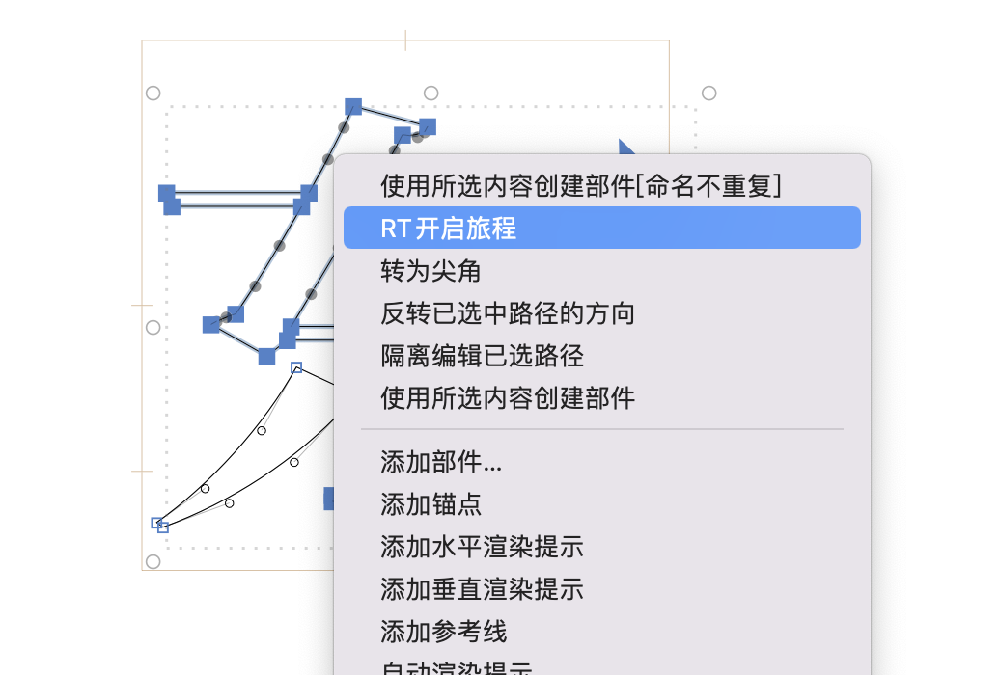
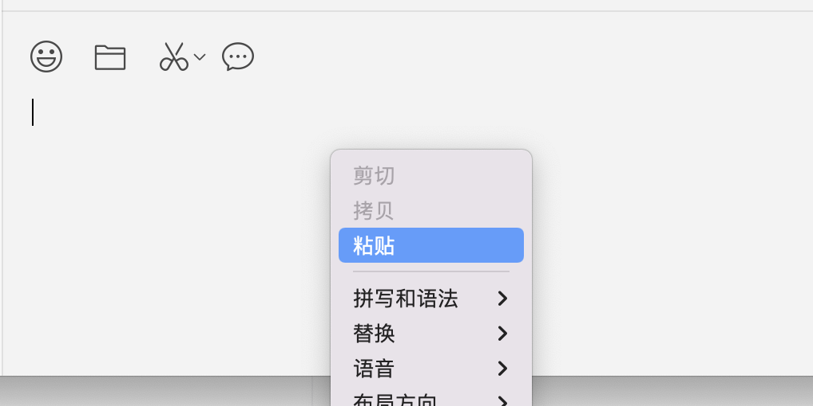
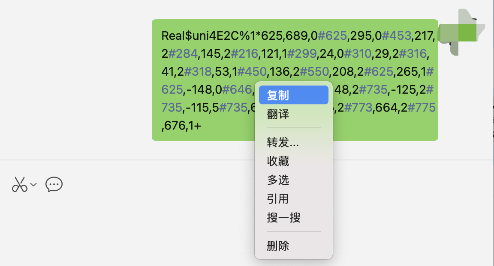
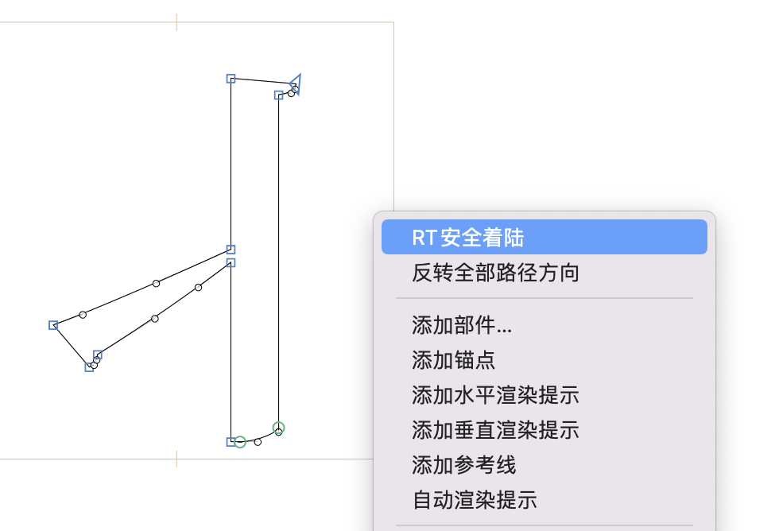

# RTFlyingGlyphs

#### 介绍
Glyphs3 Base插件，用于字形数据的旅行。

#### 使用说明
如果你有个字形或者路径想分享给你的好伙伴，可以用这个插件来一个字形数据的旅游。

1.选择你要旅行的字形路径，然后点右键，选择RT开启旅程

2.用你的社交软件（QQ或者微信）点击右键，粘贴文本数据发送给你的好伙伴。

3.你的好伙伴右键复制你发送来的文本数据(不要落下)。

4.你的好伙伴在他想要粘贴的字形编辑界面点右键，选择RT安全着陆，然后你的路径就达到目的地了。

